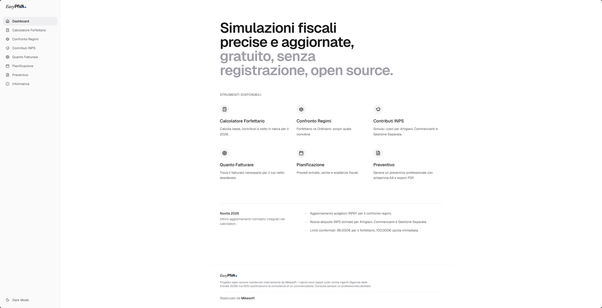

# EasyPIVA 2026

[](https://github.com/TheStreamCode/easypiva/actions/workflows/ci.yml)

Versione corrente del repository: `1.0.0`.

EasyPIVA è una web app client-side per simulazioni fiscali indicative dedicate alla Partita IVA italiana. Copre regime forfettario, contributi INPS, confronto tra regimi, pianificazione dei ricavi e generazione di preventivi con export PDF.

Tutti i calcoli vengono eseguiti localmente nel browser. Il progetto non richiede account e non usa un backend applicativo.



## Branding e packaging

- Brand prodotto: `EasyPIVA`.
- Maintainer e autore del repository: `Mikesoft`.
- Packaging supportato: applicazione web statica buildata con Vite.
- Questo repository non è una VS Code extension: non usa `vsce`, non genera `.vsix` e non richiede icone separate per Activity Bar, sidebar o Marketplace.

## Release 1.0.0

- Promuove EasyPIVA a baseline stabile del repository.
- Include correzioni fiscali 2026, validazione coerente degli input numerici e copertura E2E Playwright.
- Consolida governance GitHub, Dependabot, Dependency Review, template issue/PR e documentazione di manutenzione.
- Conferma che il branch `main` è il ramo di riferimento per release, CI e automazioni GitHub.

## Funzionalità principali

- Calcolatore del regime forfettario 2026.
- Confronto tra regime forfettario e ordinario.
- Simulatore contributi INPS per Gestione Separata, Artigiani e Commercianti.
- Calcolo inverso del fatturato necessario per raggiungere un netto obiettivo.
- Pianificazione mensile dei ricavi rispetto alle soglie del regime.
- Preventivo locale con anteprima A4, autosalvataggio della bozza nel browser ed export PDF.

## Stack

- React 19, TypeScript 5, Vite 6.
- Tailwind CSS v4 e componenti shadcn/ui.
- Zustand per lo stato client-side.
- React Hook Form e Zod per i form.
- Recharts, motion e jsPDF per visualizzazione ed export.

## Requisiti locali

- Node.js 20, in linea con la CI del repository.
- npm come package manager canonico.

## Avvio locale

```bash
git clone https://github.com/TheStreamCode/easypiva.git
cd easypiva
npm ci
npm run dev
```

L'app viene servita in sviluppo su `http://127.0.0.1:3000`.

## Script principali

- `npm run dev` avvia il server di sviluppo.
- `npm run dev:e2e` avvia Vite su `http://127.0.0.1:4173` per Playwright.
- `npm run typecheck` esegue il controllo TypeScript.
- `npm run lint` esegue ESLint.
- `npm run test` esegue la suite Vitest.
- `npm run test:e2e` esegue la suite Playwright.
- `npm run build` genera la build di produzione in `dist/`.
- `npm run ci` esegue il flusso completo usato dalla CI: format check, typecheck, lint, Vitest, build e Playwright.

## Documentazione

- [Architettura](docs/architecture.md)
- [Privacy e storage locale](docs/privacy-and-storage.md)
- [Assunzioni fiscali](docs/ADRs/0001-fiscal-assumptions.md)
- [Governance repository](docs/repository-governance.md)
- [Changelog](CHANGELOG.md)
- [Contribution policy](CONTRIBUTING.md)
- [Code of Conduct](CODE_OF_CONDUCT.md)
- [Security policy](SECURITY.md)

## Workflow del repository

Il repository è pubblico e rilasciato con licenza MIT, ma la manutenzione del codice segue un workflow `maintainers-only`. La policy completa è documentata in [`CONTRIBUTING.md`](CONTRIBUTING.md).

## Governance GitHub

- La CI principale è in `.github/workflows/ci.yml` e usa permessi minimi in sola lettura.
- Playwright usa una porta dedicata per evitare collisioni con server locali su `3000`.
- Dependabot è configurato per npm e GitHub Actions in `.github/dependabot.yml`.
- Le pull request eseguono anche `Dependency Review` per intercettare vulnerabilità introdotte da cambi di dipendenze.
- Issue e pull request usano template strutturati in `.github/` per rendere il triage riproducibile.
- Le vulnerabilità vanno segnalate privatamente seguendo [`SECURITY.md`](SECURITY.md), non tramite issue pubbliche.

## Disclaimer

I risultati sono stime indicative basate sulle assunzioni fiscali documentate nel repository. Non costituiscono consulenza fiscale, legale o contabile e non sostituiscono il parere di un professionista abilitato.

## Licenza

Distribuito sotto licenza [MIT](LICENSE).
