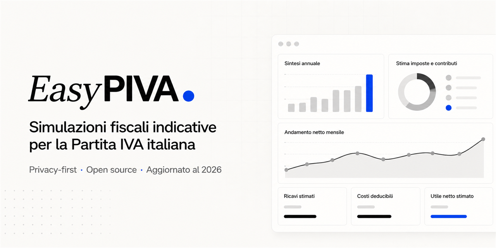

# EasyPIVA 2026

[](https://github.com/TheStreamCode/easypiva/actions/workflows/ci.yml)
[](https://github.com/TheStreamCode/easypiva/releases)
[](LICENSE)



EasyPIVA è una web app open source per simulazioni fiscali indicative dedicate alla Partita IVA italiana. Riunisce calcolo del regime forfettario, contributi INPS, confronto con il regime ordinario, pianificazione dei ricavi e generazione di preventivi con export PDF.

**[Apri EasyPIVA](https://easypiva.vercel.app)** · **[Consulta le fonti fiscali](https://easypiva.vercel.app/informativa)** · **[Leggi il changelog](CHANGELOG.md)**

- Tutti i calcoli vengono eseguiti localmente nel browser.
- Non richiede account, backend applicativo o telemetria.
- Le assunzioni fiscali 2026 sono centralizzate, testate e documentate con fonti primarie.
- Il codice è pubblico e distribuito con licenza MIT.

> I risultati sono stime indicative e non costituiscono consulenza fiscale, legale o contabile. Per decisioni professionali è necessario rivolgersi a un consulente abilitato.

## Funzionalità

- Calcolo del regime forfettario 2026.
- Confronto indicativo tra regime forfettario e ordinario.
- Simulazione dei contributi INPS per Gestione Separata, Artigiani e Commercianti.
- Calcolo inverso del fatturato necessario per raggiungere un netto obiettivo.
- Pianificazione mensile dei ricavi rispetto alle soglie del regime.
- Preventivo locale con anteprima A4, autosalvataggio nel browser ed export PDF.

## Attendibilità e limiti

EasyPIVA rende verificabili le proprie assunzioni senza presentarsi come sostituto di un professionista:

- soglie, aliquote e coefficienti sono centralizzati in `src/lib/fiscal-data.ts`;
- la logica fiscale è isolata in funzioni pure sotto `src/lib/calculations/`;
- le assunzioni e le fonti normative sono documentate nell'[ADR fiscale](docs/ADRs/0001-fiscal-assumptions.md) e nell'[informativa pubblica](https://easypiva.vercel.app/informativa);
- test unitari, UI ed end-to-end proteggono i principali casi di regressione;
- ogni cambiamento fiscale richiede aggiornamenti coordinati di codice, test, documentazione e copy pubblica.

## Domande frequenti

### I risultati differiscono da quelli del mio commercialista. Perché?

EasyPIVA produce stime indicative basate sulle assunzioni fiscali 2026 documentate nell'[ADR fiscale](docs/ADRs/0001-fiscal-assumptions.md) e nell'[informativa pubblica](https://easypiva.vercel.app/informativa), con soglie, aliquote e coefficienti centralizzati in `src/lib/fiscal-data.ts`. Un professionista può applicare deduzioni, detrazioni o situazioni personali (altri redditi, agevolazioni, acconti versati) che il simulatore non conosce. In caso di scostamento, confronta i valori inseriti con le assunzioni pubblicate e, per decisioni professionali, affidati sempre a un consulente abilitato.

### Quale gestione INPS si applica al mio caso?

L'app simula tre gestioni: Gestione Separata, Artigiani e Commercianti, secondo i valori 2026 (Circolare INPS 8/2026 per la Gestione Separata, 14/2026 per Artigiani e Commercianti). Per Artigiani e Commercianti il massimale annuo dipende dall'anzianità contributiva al 31/12/1995: 93.707 € per chi era già iscritto, 122.295 € per gli altri. La gestione corretta dipende dalla tua attività e dall'iscrizione alla Camera di Commercio o agli albi: in caso di dubbio, verifica la tua posizione con l'INPS o con un consulente.

### L'export PDF del preventivo non funziona. Cosa posso fare?

L'export avviene interamente nel browser (jsPDF con rendering via html2canvas): assicurati di usare una versione aggiornata di Chrome, Edge o Firefox, di non aver bloccato i download per il sito e di avere spazio disponibile per il salvataggio. Se hai caricato un logo personalizzato, prova con un file più leggero (formato PNG o JPEG di piccole dimensioni). Se il problema persiste, ricarica la pagina — la bozza del preventivo è autosalvata nel `localStorage` — e riprova; per segnalazioni riproducibili apri una issue seguendo [CONTRIBUTING.md](CONTRIBUTING.md).

## Privacy

Il progetto segue un'architettura local-first: non invia a un server i valori inseriti nei simulatori o nel preventivo. Tema, consenso al disclaimer e bozza del preventivo possono essere salvati nel `localStorage` del browser. Il dettaglio è in [Privacy e storage locale](docs/privacy-and-storage.md).

## Release 1.1.1

La versione corrente del repository è `1.1.1`.

- Corregge la scelta del massimale INPS 2026 per Artigiani e Commercianti in base all'anzianità contributiva.
- Rafforza accessibilità, navigazione da tastiera e gestione del menu mobile.
- Rende più robusti upload del logo, autosalvataggio ed export PDF del preventivo.
- Aggiunge controlli axe end-to-end, metadata per i crawler e aggiornamenti di sicurezza delle dipendenze.

Il dettaglio completo è nel [changelog](CHANGELOG.md).

## Stack

- React 19, React Router 8, TypeScript 6 e Vite 6.
- Tailwind CSS v4 e componenti shadcn/ui.
- Zustand, React Hook Form e Zod.
- Recharts, motion e jsPDF.
- Vitest con jsdom e Playwright con Chromium.

## Sviluppo locale

Richiede Node.js 24 LTS, npm 11 e npm come package manager canonico.

```bash
git clone https://github.com/TheStreamCode/easypiva.git
cd easypiva
npm ci
npm run dev
```

L'app viene servita su `http://127.0.0.1:3000`.

### Verifiche

```bash
npm run ci
npm audit
```

`npm run ci` esegue formattazione, typecheck, lint, test Vitest, build di produzione e test Playwright. Se Chromium non è ancora installato, esegui una volta `npx playwright install chromium`.

Gli script disponibili sono documentati in `package.json`; i principali sono `dev`, `dev:e2e`, `typecheck`, `lint`, `test`, `test:e2e`, `build` e `ci`.

## Struttura del repository

```text
src/
  pages/            # Route pubbliche, lazy loaded da App.tsx
  components/       # Layout, disclaimer e componenti del preventivo
  lib/
    calculations/   # Logica fiscale pura e testata
    quote/          # Modello preventivo, paginazione ed export PDF
    fiscal-data.ts  # Costanti fiscali 2026
  store/            # Store Zustand
components/ui/      # Primitivi UI condivisi
tests/e2e/          # Test end-to-end Playwright
docs/               # Architettura, privacy, ADR e governance
```

## Deployment

La build statica prodotta in `dist/` viene pubblicata su [Vercel](https://easypiva.vercel.app) dal branch `main`. `vercel.json` gestisce il routing client-side e gli header HTTP di sicurezza. Il progetto non utilizza un backend applicativo né variabili d'ambiente runtime.

## Documentazione

- [Architettura](docs/architecture.md)
- [Privacy e storage locale](docs/privacy-and-storage.md)
- [Assunzioni fiscali](docs/ADRs/0001-fiscal-assumptions.md)
- [Governance repository](docs/repository-governance.md)
- [Provenienza degli asset](docs/asset-provenance.md)
- [Contribution policy](CONTRIBUTING.md)
- [Security policy](SECURITY.md)
- [Code of Conduct](CODE_OF_CONDUCT.md)

## Governance e segnalazioni

Il repository è pubblico, ma la manutenzione segue un workflow `maintainers-only`. Sono benvenute issue riproducibili e segnalazioni fiscali corredate da fonti primarie; il repository non fornisce consulenza fiscale o supporto personalizzato. Consulta [CONTRIBUTING.md](CONTRIBUTING.md) prima di aprire una segnalazione e [SECURITY.md](SECURITY.md) per comunicare privatamente una vulnerabilità.

La CI usa permessi minimi, le GitHub Actions sono fissate a commit SHA e le pull request eseguono anche Dependency Review. Il branch `main` richiede review, check obbligatori, conversazioni risolte e storia lineare.

## Progetto

EasyPIVA è mantenuto da **Michael Gasperini (Mikesoft)**. Se il progetto ti è utile, puoi [supportarne lo sviluppo tramite GitHub Sponsors](https://github.com/sponsors/TheStreamCode).

## Licenza

Questo progetto è distribuito con [Licenza MIT](LICENSE).
