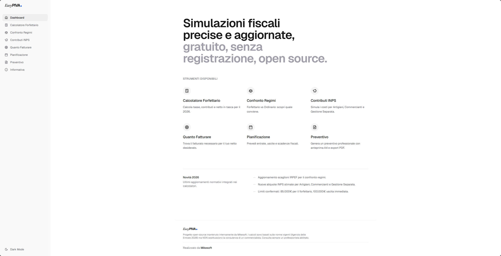

# EasyPIVA 2026

[](https://github.com/TheStreamCode/easypiva/actions/workflows/ci.yml)
[](LICENSE)

Versione corrente del repository: `1.1.0`.

EasyPIVA è una web app client-side per simulazioni fiscali indicative dedicate alla Partita IVA italiana. Copre regime forfettario, contributi INPS, confronto tra regimi, pianificazione dei ricavi e generazione di preventivi con export PDF.

Tutti i calcoli vengono eseguiti localmente nel browser. Il progetto non richiede account e non usa un backend applicativo.

**App online:** [easypiva.vercel.app](https://easypiva.vercel.app)



## Branding e packaging

- Brand prodotto: `EasyPIVA`.
- Maintainer e autore del repository: `Michael Gasperini (Mikesoft)`.
- Packaging supportato: applicazione web statica buildata con Vite.
- Questo repository non è una VS Code extension: non usa `vsce`, non genera `.vsix` e non richiede icone separate per Activity Bar, sidebar o Marketplace.

## Release 1.1.0

- Allinea i contributi INPS 2026 (minimale, contributi fissi, aliquota aggiuntiva +1% e massimale) alle Circolari INPS 8/2026 e 14/2026.
- Migliora il confronto con il regime ordinario introducendo la detrazione per redditi di lavoro autonomo.
- Aggiorna runtime e toolchain: Node.js 24 LTS, TypeScript 6, ESLint 10, `react-router` 8.
- Elimina la richiesta runtime a Google Fonts self-hostando i font nel bundle, in coerenza con l'architettura local-first.
- Ripulisce le dipendenze di sviluppo non utilizzate e allinea metadata, citazione e documentazione.

Il dettaglio completo è nel [changelog](CHANGELOG.md).

## Funzionalità principali

- Calcolatore del regime forfettario 2026.
- Confronto tra regime forfettario e ordinario.
- Simulatore contributi INPS per Gestione Separata, Artigiani e Commercianti.
- Calcolo inverso del fatturato necessario per raggiungere un netto obiettivo.
- Pianificazione mensile dei ricavi rispetto alle soglie del regime.
- Preventivo locale con anteprima A4, autosalvataggio della bozza nel browser ed export PDF.

## Stack

- React 19, React Router 8, TypeScript 6, Vite 6.
- Tailwind CSS v4 e componenti shadcn/ui.
- Zustand per lo stato client-side.
- React Hook Form e Zod per i form.
- Recharts, motion e jsPDF per visualizzazione ed export.

## Requisiti locali

- Node.js 24 LTS e npm 11, in linea con `.nvmrc`, `package.json` e CI.
- npm come package manager canonico.

## Avvio locale

```bash
git clone https://github.com/TheStreamCode/easypiva.git
cd easypiva
npm ci
npm run dev
```

L'app viene servita in sviluppo su `http://127.0.0.1:3000`.

## Script principali

- `npm run dev` avvia il server di sviluppo.
- `npm run dev:e2e` avvia Vite su `http://127.0.0.1:4173` per Playwright.
- `npm run typecheck` esegue il controllo TypeScript.
- `npm run lint` esegue ESLint.
- `npm run test` esegue la suite Vitest.
- `npm run test:e2e` esegue la suite Playwright.
- `npm run build` genera la build di produzione in `dist/`.
- `npm run ci` esegue il flusso completo usato dalla CI: format check, typecheck, lint, Vitest, build e Playwright.

Per gli end-to-end in locale può servire una sola volta `npx playwright install chromium`.

## Struttura del repository

```text
src/
  pages/            # Route pubbliche, lazy loaded da App.tsx
  components/       # Layout, disclaimer e componenti del preventivo
  lib/
    calculations/   # Logica fiscale pura e testata
    quote/          # Modello preventivo, paginazione ed export PDF
    fiscal-data.ts  # Costanti fiscali 2026 (soglie, aliquote, coefficienti)
  store/            # Store Zustand (disclaimer, tema)
components/ui/      # Primitivi UI condivisi
tests/e2e/          # Test end-to-end Playwright
docs/               # Architettura, privacy, ADR fiscale, governance
```

## Deployment

- La build statica prodotta da `npm run build` in `dist/` viene pubblicata su Vercel: <https://easypiva.vercel.app>.
- `vercel.json` applica la rewrite `/(.*) → /index.html` necessaria al routing client-side e gli header HTTP di sicurezza (CSP, anti-framing, MIME sniffing, referrer e permissions policy).
- Non esiste un backend applicativo né una configurazione di deploy alternativa nel repository.

## Documentazione

- [Architettura](docs/architecture.md)
- [Provenienza dell'asset dashboard](docs/asset-provenance.md)
- [Privacy e storage locale](docs/privacy-and-storage.md)
- [Assunzioni fiscali](docs/ADRs/0001-fiscal-assumptions.md)
- [Governance repository](docs/repository-governance.md)
- [Changelog](CHANGELOG.md)
- [Contribution policy](CONTRIBUTING.md)
- [Code of Conduct](CODE_OF_CONDUCT.md)
- [Security policy](SECURITY.md)

## Workflow del repository

Il repository è pubblico e rilasciato con licenza MIT, ma la manutenzione del codice segue un workflow `maintainers-only`. La policy completa è documentata in [`CONTRIBUTING.md`](CONTRIBUTING.md).

## Governance GitHub

- La CI principale è in `.github/workflows/ci.yml` e usa permessi minimi in sola lettura.
- Playwright usa una porta dedicata per evitare collisioni con server locali su `3000`.
- Dependabot apre solo aggiornamenti di sicurezza; gli aggiornamenti di versione ordinari sono disabilitati per evitare rumore e vengono pianificati manualmente.
- Le pull request eseguono anche `Dependency Review` per intercettare vulnerabilità introdotte da cambi di dipendenze.
- Le GitHub Actions sono fissate a commit SHA verificati e gli install script npm sono limitati a una allowlist esplicita.
- Issue e pull request usano template strutturati in `.github/` per rendere il triage riproducibile.
- Le vulnerabilità vanno segnalate privatamente seguendo [`SECURITY.md`](SECURITY.md), non tramite issue pubbliche.

## Supporta il progetto

Se EasyPIVA ti aiuta nelle simulazioni fiscali o nella pianificazione della Partita IVA, puoi supportare lo sviluppo continuo tramite GitHub Sponsors: [github.com/sponsors/TheStreamCode](https://github.com/sponsors/TheStreamCode).

## Disclaimer

I risultati sono stime indicative basate sulle assunzioni fiscali documentate nel repository. Non costituiscono consulenza fiscale, legale o contabile e non sostituiscono il parere di un professionista abilitato.

## Licenza

Distribuito sotto licenza [MIT](LICENSE).
